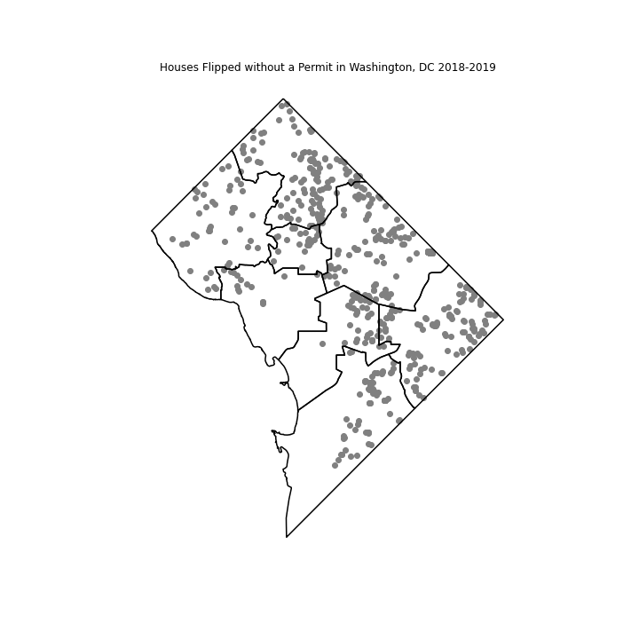
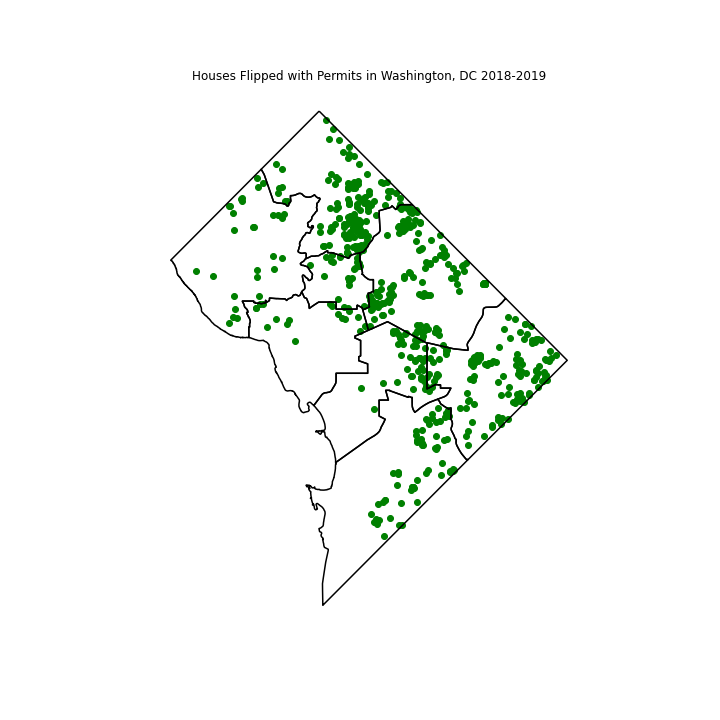
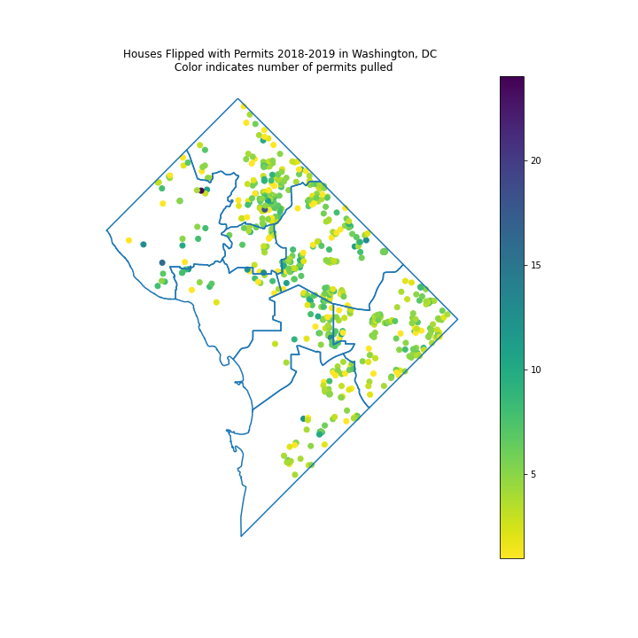

# Using Number and Type of Construction Permits to Predict Price Changes in Flipped Houses Sold in Washington, DC in 2018 and 2019

## Introduction
Home prices are soaring in Washington, DC, and developers and individuals alike are looking to cash in by buying old, out-of-date properties, updating them, and selling them for profit. In an effort to flip properties as quickly as possible, and to avoid the fees and regulations that come with permitting, flippers may skip the process of obtaining permits for construction activities altogether. Other flippers may under-permit, where they divert suspicion by applying for one or two minor permits when they actually perform much more extensive renovations. My goal with this project was to look at data sets for home sales, tax assessments, and building permits and better understand how the number and type of permits obtained during the flipping process influenced the after-sale value of a flipped home. I wanted to determine if flippers who obtained proper permits for their construction activities were rewarded with higher post-sale home values. If houses sold with appropriate permits are valued higher than their counterparts, flippers may be more incentivized to obtain permits. A good model that can predict price increase based on permitting activity would also be useful for real estate investors and other speculators who are interested in predicting how much a house will sell for.

## Visualizations

After some exploratory data analysis, flipped houses were identified as houses that increased in tax-assessed value more than 75% before and after sale. Flipped houses were then linked with construction permit data from 2015-2019. 

First, I visually explore the differences in homes flipped with and without permits by ward.  

Houses Flipped with No Permits         |  Houses Flipped with Permits          
:-------------------------:|:-------------------------: 
  |            

There are no striking differences in the patterns. For the most part, permitted and non-permitted flipped houses appear to be equally distributed across the city.

Next, I wanted to see if houses in certain areas of the city were pulling more permits than others For example, maybe Ward 8 has houses in worse condition and thus developers are pulling more permits on houses flipped there, or maybe Ward 3 has very scrupulous permitting enforcement so all houses flipped there have all proper permits. The figure below shows houses flipped with permits, with the color indicating the number of permits pulled.

There aren’t any clear patterns in the data. Houses in certain areas of the city aren’t more likely to have more permits pulled than other areas of the city.

## Models

Next, a random forest regressor model is developed to see if ward, neighborhood, property type, tax due in year of sale, and number and types of permits pulled can predict the percent increase in tax due price two years after the sale date. The random forest model predicted price increase with approximately 80% accuracy, but number and type of permit were not major contributing factors to the model. Finally, a linear regression model is developed to see how the number of permits pulled influences sale price.

Code for this project can be found in the Jupyter notebook [here](https://github.com/lkreisel/dc_flipped_houses/blob/main/DC_Flipped_Permits.ipynb). 
